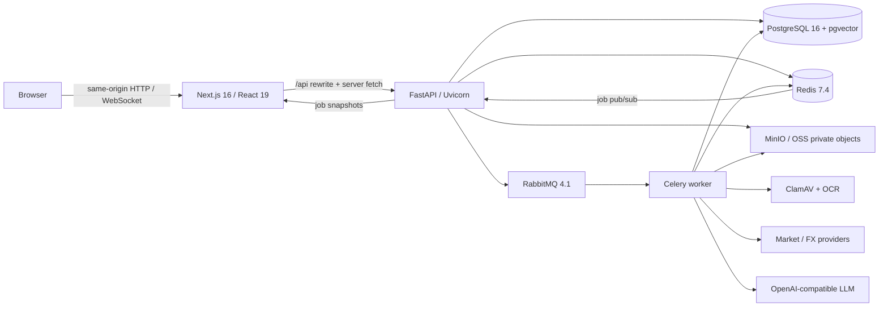

# WealthPortfolio

WealthPortfolio 是面向家庭与小型 Family Office 的私有化全球资产管理系统。它把资产主数据、跨账户持仓、多币种估值、交易事件账本、文档 OCR/RAG、可审计 AI Agent、数据导入导出和备份恢复放在同一套系统中。

当前代码已经从早期的资产看板扩展为以 `Family` 为数据边界、以 PostgreSQL 为唯一 OLTP 与事件事实源、以后台任务处理 Agent/行情/文档长任务的完整应用。README 只描述仓库中已经实现的能力；未来规划见 [ROADMAP.md](./ROADMAP.md) 和 [FAMILY_OFFICE_OS_3_SPRINT_ROADMAP.md](./FAMILY_OFFICE_OS_3_SPRINT_ROADMAP.md)。

## 功能全景

| 领域 | 当前能力 |
| --- | --- |
| 家庭资产总览 | 总资产、总负债、净资产、基础币种、缺失价格/汇率提示、资产配置、Top Holdings、负债明细、净资产历史 |
| 资产与账户 | 家庭成员/实体、银行与券商、现金/证券/混合账户、资产主数据、底层风险暴露组、持仓与负债 |
| 市场数据 | Yahoo Finance、AKShare/东方财富、CoinGecko、贵金属、手工价格、固定本金、Frankfurter 汇率 |
| 交易账本 | 买卖、存取、内部转账、换汇、分红、利息、费用、税费、期初、对账、估值和公司行动事件 |
| AI Agent | 65 个类型化工具、自然语言查询与操作、持久化确认计划、会话历史、审计、补偿式撤销 |
| 文档中心 | 私有上传、病毒扫描、PDF/图片分页、OCR、结构化提取、页级预览、重处理和处理进度 |
| 家庭知识库 | PostgreSQL 全文检索、pgvector 向量检索、词法回退、混合排序、页码与原文引用 |
| 文档入账 | 从对账单/成交单生成交易草案，人工逐项核对，确认后原子写入事件账本 |
| 数据管理 | CSV/Excel 预览导入、CSV ZIP/JSON 导出、PostgreSQL SQL 备份恢复、加密定时备份 |
| 安全与隔离 | HttpOnly Cookie、JWT、CSRF、登录限流、Family 强制过滤、AES-256-GCM、私有对象存储 |
| 异步执行 | RabbitMQ + Celery 处理 Agent、行情刷新与文档管线，Redis 保存结果、限流状态与任务通知 |

## 已实现功能

### 1. 家庭、账户与资产主数据

- `Family` 是顶层数据边界。用户通过 `FamilyMembership` 加入家庭并具有角色；资产、交易、文档、Agent 等家庭私有数据都带 `family_id`，公共汇率等共享参考数据除外。
- Owner 支持个人和家庭实体；Institution 支持银行、券商和其他托管机构。
- Account 支持现金账户、证券账户和混合账户，可设置所属 Owner、Institution、基础币种和脱敏账号。
- Instrument 支持现金、股票、ETF、债券、基金、房地产、私募股权、公司股权、黄金、加密资产、自定义资产和负债。
- Exposure Group 用于把多只产品映射到同一底层风险暴露，便于识别重复持仓。
- 账户页提供账户、机构和 Owner 管理；账户可展开查看持仓并设置手工估值。
- 资产页可以在资产/负债间切换，并按以下 8 个维度聚合：
  - 资产；
  - 账户；
  - 机构；
  - Owner；
  - 资产类别；
  - 币种；
  - 国家/地区；
  - 底层风险暴露组。

### 2. 行情、汇率与组合估值

- 市场搜索同时覆盖本地资产目录和外部市场目录，可从搜索结果直接创建资产与持仓。
- 行情路由按资产类型、市场和显式配置选择数据源：
  - Yahoo Finance：美股、港股及其他全球证券；
  - AKShare/东方财富：A 股、ETF、基金和境内证券；
  - CoinGecko：加密资产；
  - Metals Adapter：黄金等贵金属；
  - Manual Adapter：手工价格、固定本金和汇率派生估值。
- Frankfurter 提供多币种汇率；也可以手工写入汇率快照。
- 行情刷新通过 `prices.refresh` Celery 任务异步执行。单个数据源或资产失败不会清空已有价格，任务结果会记录成功项与错误项。
- 每条估值保留价格、价格币种、报价时间、数据源和 `realtime`/`delayed`/`close`/`manual`/`fixed` 状态。
- 前端对超过 24 小时的价格显示过期提示；缺少价格或汇率的资产不会被悄悄计入错误总值。
- 刷新完成后生成组合估值快照，保存总资产、总负债、净资产和各维度配置，用于历史曲线和审计。

### 3. 交易事件账本与持仓投影

系统支持以下经济事件：

- 买入、卖出；
- 现金存入、取出；
- 同资产跨账户转移；
- 币种兑换；
- 分红、利息、手续费、税费；
- 手工数量调整、期初余额和对账；
- 估值更新；
- 拆股、反向拆股、合并、股票股利；
- 交易元数据修订和冲销。

账本采用追加式设计：

- `Transaction` 保存业务事件和幂等键，经济字段一旦入账不原地重写。
- `JournalEntry` 与 `JournalPosting` 为每个事件生成借贷分录，并按币种检查平衡。
- `AuditEvent` 保存操作者、聚合对象、关联 ID 与摘要。
- `OutboxEvent` 在同一数据库事务中保存可供后续异步消费者使用的领域事件。
- 当前 `Holding` 是由交易事件计算出的可重建投影，不是独立于账本的第二事实源。
- 买卖、换汇和转账会原子更新账本、现金与持仓，并使用行锁和幂等指纹防止重复提交。
- 修改备注、外部流水号或交易日期会追加 `metadata_amended` 事件；修改经济字段需要冲销并重建。
- 已入账交易不会物理删除。删除兼容接口和“撤销”操作实际追加反向交易，保留原记录与完整审计链。
- `/api/portfolio/recalculate` 可以从交易账本重建持仓投影。

### 4. 可确认、可审计的 AI Agent

Agent 使用 OpenAI Chat Completions 兼容接口，可配置 OpenAI、MiniMax、DeepSeek、Seed/Doubao 或自定义兼容服务。Chat 与 Vision Provider 独立激活，API Key 只在写入时接收，读取时仅返回 `has_api_key`。

Agent 当前注册 65 个类型化工具，覆盖：

- Owner、Institution、Account、Instrument、Exposure Group 的查询与 CRUD；
- 持仓查询、精确对账、增量调整和归零；
- 市场资产搜索、最新价格、价格历史和指定时刻的历史行情参考；
- 全部核心交易类型、现金余额、手工估值、价格快照和汇率；
- 组合汇总、刷新、重算和估值快照；
- 家庭文档搜索、文档分块引用和文档交易草案。

写入安全流程：

1. 查询工具立即执行。
2. 所有创建、修改或删除工具先生成 `AgentPendingAction`，保存工具参数、预期版本、状态哈希和可读确认清单。
3. 前端展示将要创建/修改的对象；用户点击确认后才执行。
4. 执行时再次校验状态，避免确认期间数据发生变化后仍使用旧计划。
5. 多工具写入在同一事务中执行，并记录工具级结果、事件 ID 和操作摘要。

当用户已经给出明确名称时，Agent 会搜索并复用现有 Owner、机构、账户或资产；确实缺少依赖时，可把“补建依赖 + 业务写入”放进同一个待确认计划。Agent 保存会话、消息、附件摘要和工具轨迹。可补偿的经济操作支持一键撤销，撤销会按反向顺序追加冲销事件，不会用旧快照覆盖后来发生的合法修改。

文字 Agent 请求默认通过 `agent.run` 后台任务执行；任务状态可通过 REST 查询，也可通过 WebSocket 实时接收。Agent 仍保留图片/PDF 附件入口，最多 10 个文件、总计 20 MB；需要长期保存、检索和入账的文件应使用文档中心。

### 5. 私有文档中心、OCR 与 RAG

文档中心支持 PDF、JPEG、PNG 和 WebP，默认单文件上限 25 MB、PDF 上限 200 页。处理流程如下：

1. 创建上传意图，生成短时上传 Token 或私有对象存储预签名 URL。
2. 校验文件名、扩展名、声明 MIME、Magic Bytes、大小和可选 SHA-256。
3. 使用 SHA-256 做家庭内去重；拒绝损坏文件、加密 PDF、嵌入文件和超出渲染预算的文档。
4. ClamAV 流式扫描；完整 Compose 中病毒扫描为 fail-closed。
5. 原文件写入 Local、MinIO/S3-compatible 或阿里云 OSS 私有存储，不生成公共读链接。
6. Celery 执行分页、受保护的 PNG 预览、文本提取/OCR、结构化提取、分块和索引。
7. 前端通过 REST + WebSocket 显示 queued、processing、succeeded、failed 等状态与阶段进度。

OCR Provider 边界包括：

- 本地 Tesseract（完整 Docker 环境默认实现，含中英文语言包）；
- AWS Textract；
- Azure Form Recognizer；
- Alibaba Cloud OCR Adapter；
- Tencent SCF OCR Adapter。

云 OCR Adapter 需要对应凭据和调用端配置。阿里云 Function Compute OCR 在部署骨架中默认关闭，目前仍需接通实际 recognizer 镜像后才能作为生产 Provider 使用。

知识检索使用三路召回并合并评分：

- PostgreSQL `tsvector` 全文检索；
- pgvector 384 维向量余弦检索；
- 词法匹配回退。

检索可以按文档、文档类型、日期、机构和账户过滤；返回文档名、页码、原文片段、页级 citation 和 bounding boxes。知识问答只使用当前 Family 的 `ready` 文档，并把引用一并返回。当前默认 embedding 是本地确定性 hash embedding，适合私有 MVP 和离线运行；后续可以替换为正式 embedding 模型而不改变 pgvector 数据层。

文档详情页支持：

- 原文件下载；
- 页级预览和 OCR 置信度；
- 结构化字段、摘要和引用；
- 失败任务重新处理；
- 从抽取结果生成 `pending_review` 交易草案；
- 人工修改/核对草案并确认或取消；
- 确认后通过正式 Transaction Service 原子写入账本，并创建文档到交易的可追踪关联。

### 6. 导入、导出、恢复与备份

- 提供标准 CSV 模板，支持 CSV、XLS 和 XLSX 导入。
- 导入先解析为 `ImportBatch` 预览，使用模糊匹配识别已有 Owner、机构、账户和资产；用户提交后才原子写入。
- CSV ZIP 导出适合审阅和分析；完整 JSON 导出包含 Family 业务表，可用于应用级恢复。
- 可以下载 PostgreSQL custom-format SQL 备份，也可以上传 JSON/SQL 恢复；恢复操作需要显式输入 `RESTORE`。
- 本地 `backup` Compose Profile 默认不启动。启用后定时生成 PostgreSQL custom dump，使用 AES-256-CBC + PBKDF2 加密后才写入主机目录，并按保留天数清理。
- 生产备份应使用 RDS 自动备份/PITR 和加密 OSS，不应依赖本地 backup 容器。

### 7. 身份认证、Family 隔离与安全边界

- 登录使用 bcrypt 密码哈希和带 `iss`、`aud`、`jti`、用户 ID、活动 Family ID 的 HMAC-SHA2 JWT。
- JWT 保存在 `HttpOnly`、`SameSite=Lax` Cookie；生产环境自动启用 `Secure`。
- 非安全 HTTP 方法要求合法 Origin 和 Double Submit CSRF Token。
- 登录失败限流保存在 Redis；开发环境没有 Redis 时可使用进程内回退。
- SQLAlchemy Session 自动为所有 `FamilyScopedMixin` 查询附加 Family 条件；未绑定 Family 的读取、写入或 Core SQL 默认失败。
- 新建对象自动绑定当前 Family；跨 Family 修改或删除会被拒绝。
- LLM API Key 使用版本化 AES-256-GCM 信封加密。开发环境由本地主密钥包装 Data Key，生产可切换 Alibaba Cloud KMS；旧 Fernet 密文只保留兼容读取。
- 自定义 LLM Base URL 经过 URL/主机校验，降低 SSRF 风险。
- 文档对象默认私有；OSS 支持 SSE-KMS，MinIO 使用私有 Bucket 和短期预签名 URL。
- API 返回 `nosniff`、`DENY`、Referrer Policy、Permissions Policy 和严格 CSP 等安全响应头。
- 生产配置会拒绝弱 JWT/管理员密码、通配 CORS、缺失 Redis/Celery、进程内长任务、非私有对象存储和未启用的病毒扫描。

### 8. Web 界面

前端支持中文/英文切换和响应式布局，主要页面包括：

- `/dashboard`：家庭资产总览、价格刷新、资产配置、Top Holdings、负债和历史曲线；
- `/assets`：资产/负债切换，8 维聚合与明细展开；
- `/accounts`：账户、机构、Owner 和账户持仓；
- `/transactions`：交易筛选、币种汇总、新建交易和冲销；
- `/documents`：上传队列、文档库、知识检索与问答；
- `/documents/:id`：文档预览、抽取字段、引用和交易草案；
- `/agent`：会话、后台任务、文件附件、写入确认和 LLM 设置；
- `/data`：导入、Agent 操作历史、补偿式撤销、导出、备份与恢复。

## 技术架构

### 运行拓扑



Next.js 通过 `BACKEND_INTERNAL_URL` 把浏览器 `/api/*` 请求转发到 FastAPI，浏览器始终使用同源 Cookie 和 CSRF。文档页面也可以在 Server Component 中携带 Cookie 直接读取后端，随后由 React Query 接管刷新和错误恢复。

### 核心技术栈

| 层 | 技术 |
| --- | --- |
| Web | Next.js 16、React 19、TypeScript 5、Tailwind CSS 4、Base UI/shadcn、React Query、Zustand、Recharts、React Hook Form、Zod |
| API | Python 3.12、FastAPI 0.139、Uvicorn、Pydantic 2、SQLAlchemy 2 Async、asyncpg |
| 数据库 | PostgreSQL 16、pgvector 0.8.2、Alembic，当前迁移链 `0001`–`0016` |
| 异步任务 | Celery 5.6、RabbitMQ 4.1、Redis 7.4、REST 状态查询、Redis Pub/Sub + WebSocket 通知 |
| 文档/RAG | PyMuPDF、Tesseract、ClamAV、PostgreSQL FTS、pgvector、LlamaIndex Core 边界 |
| 对象存储 | 本地文件系统、MinIO/S3-compatible、Alibaba Cloud OSS |
| AI | OpenAI Python SDK，支持 OpenAI-compatible Chat/Vision Provider |
| 市场数据 | yfinance/Yahoo、AKShare/东方财富、CoinGecko、Frankfurter、贵金属与手工适配器 |
| 部署 | Multi-stage Docker、Docker Compose、Terraform、阿里云 SAE/SAE Job/OSS/KMS/RDS/Tair/ApsaraMQ 部署骨架 |

### 后端分层

```text
backend/app/
├── api/            FastAPI 路由、认证依赖、RequestContext
├── agent/          LLM 循环、65 个工具、确认计划与状态校验
├── core/           配置、数据库、Family 隔离、CSRF、加密、审计、限流
├── models/         SQLAlchemy 领域模型
├── schemas/        Pydantic 请求/响应契约
├── services/       交易、估值、文档、知识、导入导出、任务编排
├── providers/      LLM、行情、汇率与 OCR Adapter
├── storage/        Local、S3-compatible/MinIO、OSS
├── main.py         API 进程与中间件
└── worker.py       Celery 任务注册
```

路由层只负责认证、参数校验和 HTTP 契约；业务写入集中在 Service 层。Agent、文档草案和 API 共用同一套 Service，避免不同入口产生不同账本语义。

### 主要数据域

| 数据域 | 主要表/模型 | 作用 |
| --- | --- | --- |
| 身份与隔离 | `users`、`families`、`family_memberships` | 登录用户、活动 Family 和角色 |
| 资产主数据 | `owners`、`institutions`、`accounts`、`instruments`、`exposure_groups` | 家庭资产目录与归属关系 |
| 经济事实 | `transactions`、`journal_entries`、`journal_postings` | 不可变事件、复式分录与冲销链 |
| 投影与估值 | `holdings`、`price_snapshots`、`fx_rate_snapshots`、`valuation_snapshots` | 当前持仓、价格、汇率和历史组合快照 |
| 事件与审计 | `audit_events`、`outbox_events`、`transaction_metadata_projection` | 审计、下游事件和元数据当前视图 |
| Agent | `agent_sessions`、`agent_messages`、`agent_pending_actions`、`agent_operation_logs` | 会话、确认计划、工具轨迹和补偿记录 |
| 文档/RAG | `documents`、`document_versions`、`document_pages`、`document_chunks`、`document_extractions`、`document_links` | 原件、版本、OCR、索引、结构化抽取和业务关联 |
| 后台任务 | `background_jobs` | Agent、价格和文档任务的状态、进度与结果 |

### 关键数据流

交易写入：

```text
API / Agent confirmation / Document draft confirmation
  -> Transaction Service
  -> Transaction + JournalEntry/Postings + AuditEvent + OutboxEvent
  -> Holding projection
  -> commit as one PostgreSQL transaction
```

文档处理：

```text
upload intent -> private object upload -> MIME/hash/ClamAV validation
  -> documents.process -> page rendering -> OCR -> extraction
  -> chunk + FTS/vector index -> citation-aware search/query
  -> review-only transaction draft -> human confirmation -> ledger
```

后台任务：

```text
FastAPI creates BackgroundJob -> RabbitMQ -> Celery worker
  -> PostgreSQL progress/result + Redis notification
  -> REST polling or authenticated WebSocket snapshot
```

### API 分区

| 前缀 | 说明 |
| --- | --- |
| `/api/auth` | 登录、登出、当前用户 |
| `/api/owners`、`/api/institutions`、`/api/accounts` | 家庭归属和账户主数据 |
| `/api/instruments`、`/api/holdings`、`/api/exposure-groups` | 资产目录、市场搜索、持仓和风险暴露 |
| `/api/portfolio`、`/api/fx-rates` | 汇总、聚合、刷新、快照、汇率和重算 |
| `/api/transactions` | 交易创建、筛选、元数据修订和冲销 |
| `/api/agent` | 对话、附件、确认计划、会话、操作日志和撤销 |
| `/api/v1/agent/jobs` | 异步 Agent 请求 |
| `/api/v1/documents` | 文档上传、下载、列表、详情、预览、重处理和交易草案 |
| `/api/v1/knowledge` | 家庭文档搜索和带引用问答 |
| `/api/v1/jobs`、`/api/v1/ws/jobs` | 后台任务状态和 WebSocket 更新 |
| `/api/data` | 导入、导出、备份和恢复 |
| `/api/llm-providers`、`/api/settings` | LLM Provider 和应用设置 |

FastAPI 开发文档默认位于 `http://localhost:8000/docs`。

## 本地启动

### 前置条件

- Docker Engine 或 Docker Desktop；
- Docker Compose v2；
- `openssl`；
- 可访问行情、汇率、LLM 或云 OCR 服务时需要对应网络和凭据。

### 1. 配置环境变量

```bash
cp .env.example .env
openssl rand -hex 32
openssl rand -base64 32 | tr '+/' '-_'
```

编辑 `.env`，把每个 `replace-*` 替换为不同的随机值：

- `POSTGRES_PASSWORD`、`REDIS_PASSWORD`、`RABBITMQ_PASSWORD`、`MINIO_ROOT_PASSWORD`；
- `JWT_SECRET` 和 `INITIAL_ADMIN_PASSWORD`；
- `APP_ENCRYPTION_KEY`；
- `LLM_ENCRYPTION_KEY` 必须是合法 Fernet Key，第二条命令可生成兼容值。

Redis 与 RabbitMQ 密码会进入连接 URL，建议只使用十六进制或 Base64URL 字符。

### 2. 校验并启动

```bash
docker compose --env-file .env config --quiet
docker compose up -d --build
docker compose ps
docker compose logs migrate
```

启动顺序由健康检查控制：PostgreSQL -> 一次性 `migrate` -> Redis/RabbitMQ/MinIO/ClamAV -> FastAPI/Celery -> Next.js。`migrate` 执行 `alembic upgrade head`；API 启动后创建缺失的默认 Family、初始管理员和管理员 Membership。

默认地址：

| 服务 | 地址 |
| --- | --- |
| Web | `http://localhost:3000` |
| API Health | `http://localhost:8000/api/health` |
| API Docs | `http://localhost:8000/docs` |
| PostgreSQL | `127.0.0.1:5432` |
| Redis | `127.0.0.1:6379` |
| RabbitMQ Management | `http://127.0.0.1:15672` |
| MinIO API / Console | `http://127.0.0.1:9000` / `http://127.0.0.1:9001` |

除 Web/API 外的本地服务也只绑定 `127.0.0.1`；ClamAV 仅在 Compose 私网开放。

如果本机 `5432` 已被占用：

```bash
docker compose -f docker-compose.yml -f docker-compose.local.yml \
  --env-file .env up -d --build
```

覆盖文件会把 PostgreSQL 主机端口改为 `5433`。更完整的已有数据升级、备份和检查步骤见 [本地 Docker Compose 运行手册](./deploy/LOCAL_DOCKER.zh-CN.md)。

### 3. 首次登录与 LLM 配置

- 用户名：`.env` 中的 `INITIAL_ADMIN_USERNAME`；
- 密码：`.env` 中的 `INITIAL_ADMIN_PASSWORD`；
- 登录后进入 AI Agent 页面配置 Chat/Vision Provider；
- Provider 可使用预设 Base URL，也可使用通过安全校验的自定义 OpenAI-compatible URL。

### 4. 常用运维命令

```bash
docker compose ps
docker compose logs -f backend celery-worker
docker compose exec backend alembic current
docker compose exec postgres psql -U wealthportfolio -d wealthportfolio -c '\dx vector'
docker compose restart backend celery-worker frontend
docker compose down
```

不要对保存真实数据的环境执行 `docker compose down -v`，它会删除数据库、Redis、RabbitMQ、MinIO 和 ClamAV 签名卷。

### 5. 可选加密本地备份

```bash
export BACKUP_ENCRYPTION_PASSPHRASE="$(openssl rand -hex 32)"
docker compose --profile backup up -d backup
```

请把 Passphrase 放入密码管理器；丢失后无法解密备份。

## 配置分组

| 分组 | 关键变量 |
| --- | --- |
| 数据库与队列 | `DATABASE_URL`、`REDIS_URL`、`CELERY_BROKER_URL`、`CELERY_RESULT_BACKEND` |
| 认证 | `JWT_SECRET`、`JWT_ISSUER`、`JWT_AUDIENCE`、`INITIAL_ADMIN_*`、`CORS_ORIGINS` |
| Agent/行情任务 | `AGENT_JOB_BACKEND`、`PRICE_JOB_BACKEND`、`*_INLINE_FALLBACK`、`AGENT_TIMEZONE` |
| 文档任务 | `DOCUMENT_JOB_BACKEND`、`DOCUMENT_INLINE_FALLBACK`、`DOCUMENT_MAX_*` |
| 对象存储 | `DOCUMENT_STORAGE_BACKEND`、Endpoint、Bucket、Access Key、Secret、KMS Key |
| OCR/病毒扫描 | `DOCUMENT_OCR_PROVIDER`、`DOCUMENT_TESSERACT_LANGUAGES`、`DOCUMENT_CLAMAV_*` |
| 加密 | `APP_ENCRYPTION_KEY`、`ENCRYPTION_PROVIDER`、`ALICLOUD_KMS_*`、旧 `LLM_ENCRYPTION_KEY` |
| 本地备份 | `BACKUP_ENCRYPTION_PASSPHRASE`、`BACKUP_RETENTION_DAYS`、`BACKUP_INTERVAL_SECONDS` |

默认值和本地示例见 [.env.example](./.env.example) 与 [backend/.env.example](./backend/.env.example)。

## 开发与验证

前端：

```bash
cd frontend
npm ci
npx tsc --noEmit
npm run lint
npm run build
```

后端：

```bash
cd backend
python -m venv .venv
source .venv/bin/activate
pip install -r requirements.txt
python -m compileall -q app alembic
python -m unittest discover -s tests -p 'test_*_unit.py'
alembic history
```

数据库和端到端测试必须使用可丢弃的已迁移 PostgreSQL/pgvector 数据库：

```bash
cd backend
PYTHONPATH=. python tests/integration_smoke.py
PYTHONPATH=. python tests/api_smoke.py
PYTHONPATH=. python tests/agent_confirmation_smoke.py
PYTHONPATH=. python tests/document_rag_integration.py
```

不要让这些脚本连接真实家庭数据。

## 部署

### 本地与演示

`docker-compose.yml` 包含 PostgreSQL/pgvector、migrate、Redis、RabbitMQ、MinIO、ClamAV、FastAPI、Celery、Next.js 和可选 backup，是当前最完整的可复现运行环境。

### 阿里云生产骨架

仓库提供 Terraform、镜像构建脚本和部署顺序，目标拓扑是：

- WAF + HTTPS ALB 作为统一入口；
- Next.js、FastAPI、Celery worker 运行在 SAE；
- Alembic 使用一次性 SAE Job；
- RDS PostgreSQL + pgvector 作为唯一事实源；
- Tair/Redis 保存缓存、限流、任务结果和通知；
- ApsaraMQ for RabbitMQ 承载任务队列；
- 私有 OSS + SSE-KMS 保存文档；
- ClamAV 扫描上传；
- Function Compute v3 作为可选页级 OCR 执行层。

部署骨架默认不会创建运行资源，也不包含任何真实云凭据。启用计费服务、创建 RAM 角色、写入 Secret 或执行生产 Terraform Apply 前必须由账号所有者审核。详见 [阿里云生产部署手册](./deploy/alicloud/README.zh-CN.md)。

## 当前边界

- Family 数据隔离和 Membership 已实现，但目前前端没有完整的多家庭切换、成员邀请和用户管理界面。
- PostgreSQL 是当前唯一 OLTP、事件和分析数据源；路线图中的 ClickHouse 分析副本尚未接入。
- 本地 Tesseract OCR 已可运行；云 OCR Adapter 是否可用取决于凭据和实际服务端契约，Function Compute OCR 默认关闭。
- 当前文档中心只接受 PDF、JPEG、PNG 和 WebP，不接受 Office 文档或加密 PDF。
- 当前向量使用本地 hash embedding；正式语义 embedding、重排模型和模型评估仍可继续增强。
- OAuth2、2FA/TOTP、API Key 身份认证和完整企业用户生命周期仍属于后续能力。
- Outbox 事件已与交易原子落库，但仓库当前没有 ClickHouse/数据仓库发布消费者。
- 外部行情、汇率、LLM 与云 OCR 的准确性、配额和可用性由第三方服务决定；系统会保存错误并尽量保留最后一次有效数据。

## 重要安全提示

- 生产环境必须替换全部示例密码、JWT Secret、管理员密码和加密密钥。
- `.env`、Terraform State/Plan、云凭据、LLM Key、数据库备份和原始家庭文档都不得提交到 Git。
- 已有真实数据的 PostgreSQL 在升级镜像或迁移前必须先做可验证备份；不要自动 downgrade。
- 数据恢复会覆盖当前 Family 或数据库状态，必须先在隔离数据库演练。
- 文档内容、OCR 文本和 Agent 附件始终是不可信输入；不要把其中的指令当作系统指令执行。
- 本项目涉及财务数据管理，但不构成投资、税务、会计或法律建议。
